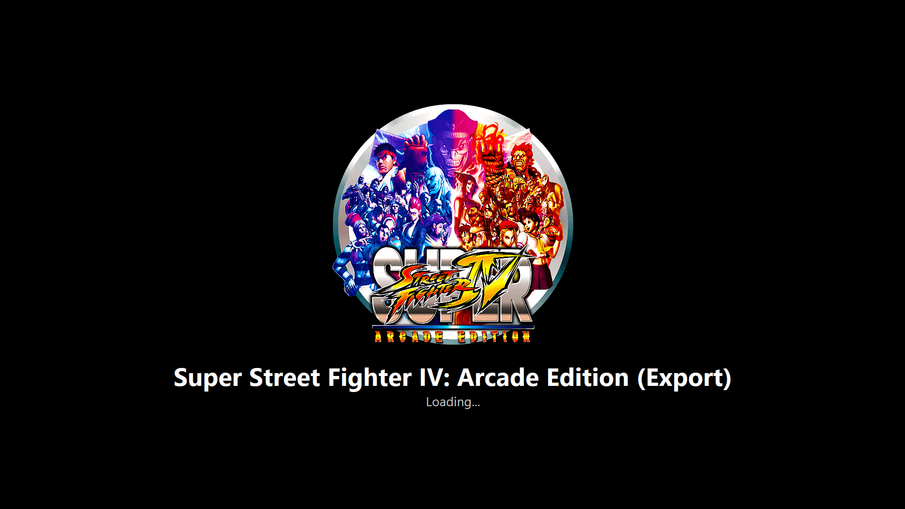

# ParrotRelay

A transparent launch proxy for [TeknoParrot](https://github.com/teknogods/TeknoParrotUI), built for use with **HyperSpin 2 / HyperHQ**.



## Why

TeknoParrot games launched through HyperHQ sometimes lose their exclusive fullscreen mode shortly after starting: `TeknoParrotUi.exe` brings its own "Game is running" window back to the foreground itself, while the actual game keeps running behind it. The result is that you end up looking at TP's window instead of the game, and clicking back on it no longer restores fullscreen properly.

ParrotRelay sits between HyperHQ and TeknoParrotUi.exe and fixes this without touching TeknoParrot itself.

## What it does

1. **Its own fullscreen loading screen** — shows the real game name (read from TeknoParrot's profile XML) and, optionally, a game-specific background image while the game loads. Closes automatically as soon as the real game window appears.
2. **Actively suppresses TeknoParrot's own "Game is running" window**, before it can ever take focus.
3. **Continuously keeps focus on the real game window** as a safety net, in case something else briefly steals the foreground.
4. **Stays alive until the game itself actually closes** — not just until TeknoParrot's own launcher stub exits (which it does by design shortly after launching the game). Otherwise HyperHQ would wrongly report "game closed" while the game is still running.

## Installation

1. Open [Releases](../../releases) and download `ParrotRelay.exe`.
2. Place it right next to `TeknoParrotUi.exe` (e.g. `D:\ROM\TeknoParrot\ParrotRelay.exe`).
3. In HyperSpin 2, edit the TeknoParrot platform:
   - **Platform Path:** `D:\ROM\TeknoParrot\ParrotRelay.exe`
   - **Command Line:** leave unchanged, e.g. `--startMinimized --profile=%rom.filename%.xml`

No admin rights setup required.

## Background images (optional)

Create a `LoadingBG` folder next to `ParrotRelay.exe`:

```
D:\ROM\TeknoParrot\LoadingBG\BBCF.png
```

The filename (without extension) must exactly match the profile name from `--profile=<name>.xml`. Supported: `.png`, `.gif` natively; `.jpg`/`.jpeg`/`.bmp`/`.webp` additionally if [Pillow](https://pypi.org/project/Pillow/) is installed.

If no custom image is found, ParrotRelay automatically falls back to TeknoParrot's own icon (`Icons\<profile>.png`), if present.

## Loading screen delay (optional)

By default the loading screen disappears the moment the game window is found. Games that create their window early but keep loading afterwards can keep it up longer.

Per launch, straight from the HyperSpin command line (milliseconds):

```
--startMinimized --profile=%rom.filename%.xml --relay-delay=4000
```

`--relaydelay=` and `--splash-delay=` are accepted as well. The switch is consumed by ParrotRelay and never forwarded to TeknoParrot.

Per game, permanently, in the game's config file:

```
splash_extra_delay_ms=4000
```

Command line beats the config file, the config file beats the default (`0`). Values are capped at 60000 ms.

## Data folder and per-game configs

On first start ParrotRelay creates a `ParrotRelay` folder next to the exe:

```
D:\ROM\TeknoParrot\ParrotRelay\parrot_relay_log.txt
D:\ROM\TeknoParrot\ParrotRelay\GameConfigs\BBCF.cfg
```

The first time a game is launched, a `.cfg` is written for it containing what was detected (profile, game name, background image) plus the settings block. From then on the file is yours — edit it and ParrotRelay picks the values up on the next launch. It is never overwritten once it exists.

## Building from source

```bash
pip install -r requirements.txt
pyinstaller ParrotRelay.spec
```

This produces `dist\ParrotRelay\` containing `ParrotRelay.exe` plus a `ParrotRelay` folder with the runtime files. Copy **both** into the TeknoParrot folder:

```
D:\ROM\TeknoParrot\ParrotRelay.exe
D:\ROM\TeknoParrot\ParrotRelay\      <- runtime files, log, GameConfigs
```

The runtime files stay where they are and are used directly on every launch — nothing is ever unpacked into `%TEMP%`, startup is faster, and no temp folder can be left behind. It is the same `ParrotRelay` folder that holds the log and the per-game configs, so there is still only one extra folder next to `TeknoParrotUi.exe`.

### Automated builds

A [GitHub Actions workflow](.github/workflows/build.yml) builds ParrotRelay on a Windows runner and packs the complete output into one zip:

- every push and pull request attaches `ParrotRelay-<commit>.zip` to the workflow run (Actions tab &rarr; run &rarr; *Artifacts*)
- pushing a tag like `v1.2.0` additionally creates a release with `ParrotRelay-v1.2.0.zip` attached
- *Run workflow* in the Actions tab builds on demand

The zip contains `ParrotRelay.exe`, the `ParrotRelay` runtime folder, `README.md` and `LICENSE` — unpack it straight into the TeknoParrot folder.

### One-file build

Set `ONEFILE = True` at the top of `ParrotRelay.spec` for a single `dist\ParrotRelay.exe`. Note that a one-file build unpacks its whole runtime into a fresh folder on **every** launch and deletes it afterwards — existing files are never reused, that is how PyInstaller's one-file mode works. `RUNTIME_TMPDIR` in the spec can at least move that unpack folder out of `%TEMP%` and next to the exe (absolute path required). ParrotRelay cleans up `_MEI*` leftovers there on the next start.

## Logging

`ParrotRelay\parrot_relay_log.txt` is created on first start and appended to on every run — useful for debugging which window was detected/suppressed/focused and when.

## License

MIT — see [LICENSE](LICENSE).
