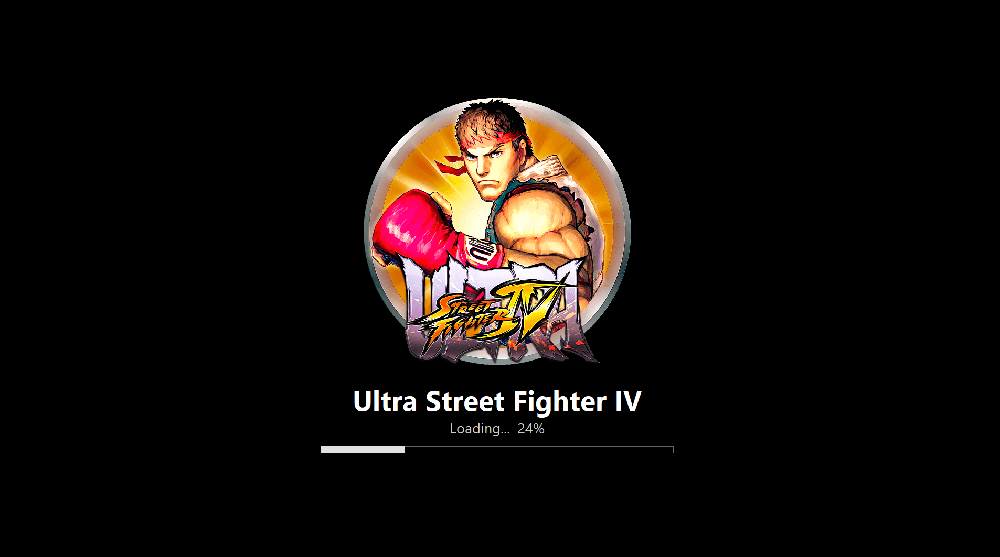
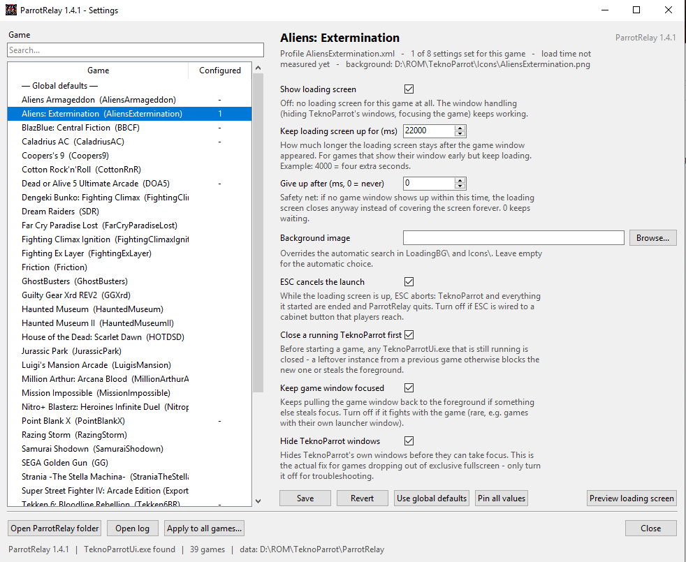

# ParrotRelay

A transparent launch proxy for [TeknoParrot](https://github.com/teknogods/TeknoParrotUI), built for use with **HyperSpin 2 / HyperHQ**.

It sits between HyperHQ and `TeknoParrotUi.exe`, forwards the command line unchanged, and takes care of everything that makes a TeknoParrot game look unpolished on a cabinet: the loading screen, the focus, and the cleanup afterwards.



## Why

TeknoParrot games launched through HyperHQ sometimes lose their exclusive fullscreen mode shortly after starting: `TeknoParrotUi.exe` brings its own "Game is running" window back to the foreground itself, while the actual game keeps running behind it. You end up looking at TP's window instead of the game, and clicking back on it no longer restores fullscreen properly.

ParrotRelay fixes that without touching TeknoParrot itself.

## What it does

**A fullscreen loading screen** with the real game name (read from TeknoParrot's profile XML), a game-specific background image, and a progress bar. It closes the moment the real game window appears.

**A progress bar that learns each game.** Every launch stores how long the game took from start until its window appeared, in the game's config as `measured_load_ms`. The next launch predicts from it and then stores `(new time + stored time) / 2`, so the estimate settles on a realistic value within a few launches and follows a changed machine on its own.

Stored load time plus any extra delay is the expected total; one percent of it is one step of the bar, which simply follows the clock. Two things the clock cannot know are handled on top: while the game window has not appeared the bar stops at 99% instead of claiming to be done, and once the window is there the remaining time is known exactly, so the bar runs up to 100% and arrives precisely when the loading screen closes. A game with no measured time yet runs indeterminate rather than showing a made-up percentage.

**Follows a resolution change.** Games routinely switch the display mode while starting. The loading screen notices and rebuilds itself for the new resolution — text, image and bar are re-measured and re-centred instead of hanging half off the screen.

**Hides TeknoParrot's own windows** ("Game is running") as soon as they appear, before they can take the foreground. This is the actual fullscreen fix — refocusing after the fact is already too late.

**Keeps focus on the game window** as a safety net, in case something else briefly steals the foreground. While the loading screen is held for the extra delay, the game is given the foreground behind it — games that switch to exclusive fullscreen otherwise minimise themselves because they never got focus, which is exactly why the resolution-changing games were the ones losing focus when a delay was set.

**Closes a leftover TeknoParrot** before starting a new game. A `TeknoParrotUi.exe` still running from an earlier launch keeps its profile locked, steals the foreground, or stops the new one from starting at all.

**ESC cancels a launch.** While the loading screen is up, ESC ends TeknoParrot and every process it started, instead of leaving a half-started game behind.

**Stays alive until the game itself closes** — not just until TeknoParrot's launcher stub exits, which it does by design shortly after starting the game. Otherwise HyperHQ would report "game closed" while the game is still running.

**A settings window** for all of it, so nothing has to be configured by hand.

## Installation

1. Open [Releases](../../releases) and download the zip.
2. Unpack it into the TeknoParrot folder, so that `TeknoParrotUi.exe` and the `ParrotRelay` folder sit side by side.
3. In HyperSpin 2, edit the TeknoParrot platform:
   - **Platform Path:** `D:\ROM\TeknoParrot\ParrotRelay\ParrotRelay.exe`
   - **Command Line:** leave unchanged, e.g. `--startMinimized --profile=%rom.filename%.xml`

No admin rights setup required. The **[Microsoft Visual C++ 2015-2022 Redistributable (x64)](https://aka.ms/vs/17/release/vc_redist.x64.exe)** has to be installed on the machine — see [Requirements](#requirements).

Double-click `ParrotRelay.exe` once afterwards: the settings window opens and its status line tells you whether TeknoParrot and your games were found.

## Settings window

Start `ParrotRelay.exe` **without arguments** — double-click it instead of letting HyperSpin call it — and it opens the settings window instead of launching anything.



- every TeknoParrot game is listed, with a search box; the *Configured* column shows how many values a game has of its own
- **double-click a game to launch it**, loading screen and all — the quickest way to try a setting without walking over to the frontend. The window minimises while the game runs
- **Global defaults** (the first entry) apply to every game; a game only stores what actually differs from them, so changing a default still reaches every game that never overrode it
- **Use global defaults** drops everything stored for one game; **Load defaults** puts ParrotRelay's built-in values into the form, so you can see what they were and get back to them
- **Apply to all games** writes one set of values to every game at once, for cabinet-wide settings
- **Preview loading screen** shows the splash exactly as it will look at launch — the quickest way to check a background image
- **Open ParrotRelay folder** and **Open log** for everything else

Hover over a setting to see what it does. Everything the window writes is a plain text file you can also edit by hand.

| Setting | What it does |
|---|---|
| Show loading screen | Off = no splash for this game; the window handling keeps working |
| Keep loading screen up for (ms) | Extra time after the game window appeared, for games that show their window early but keep loading |
| Give up after (ms) | Safety net: closes the splash if no game window ever appears — two minutes by default, `0` waits forever |
| Background image | Overrides the automatic search in `LoadingBG\` and `Icons\` |
| ESC cancels the launch | Turn off if ESC is wired to a cabinet button players can reach |
| Close a running TeknoParrot first | Ends any leftover `TeknoParrotUi.exe` before starting the new one |
| Focus the game during the delay | Gives the game the foreground behind the loading screen; off keeps the screen in front for good |
| Keep game window focused | The continuous refocus safety net |
| Hide TeknoParrot windows | The actual fullscreen fix — only turn off for troubleshooting |

## Background images

Create a `LoadingBG` folder in the TeknoParrot folder:

```
D:\ROM\TeknoParrot\LoadingBG\BBCF.png
```

The filename (without extension) must match the profile name from `--profile=<name>.xml`. Supported: `.png` and `.gif` natively, plus `.jpg`/`.jpeg`/`.bmp`/`.webp` when [Pillow](https://pypi.org/project/Pillow/) is available.

If no custom image is found, ParrotRelay falls back to TeknoParrot's own icon (`Icons\<profile>.png`), which is what the screenshot above shows. Without either, the splash stays black.

## Loading screen delay from HyperSpin

Besides the settings window, the delay can be set per launch straight from the command line, in milliseconds:

```
--startMinimized --profile=%rom.filename%.xml --relay-delay=4000
```

`--relaydelay=` and `--splash-delay=` are accepted as well. The switch is consumed by ParrotRelay and never forwarded to TeknoParrot.

Precedence: command line &rarr; game config &rarr; global defaults &rarr; built-in default (`0`). Values are capped at 60000 ms.

## Folder layout and config files

ParrotRelay lives in its own folder inside the TeknoParrot folder:

```
D:\ROM\TeknoParrot\ParrotRelay\ParrotRelay.exe
D:\ROM\TeknoParrot\ParrotRelay\RelayData\             <- runtime files of the exe
D:\ROM\TeknoParrot\ParrotRelay\GameConfigs\BBCF.cfg   <- one per game
D:\ROM\TeknoParrot\ParrotRelay\ParrotRelay.cfg        <- global defaults
D:\ROM\TeknoParrot\ParrotRelay\parrot_relay_log.txt
```

`RelayData` holds everything that belongs to the exe — DLLs and the like — and never needs to be opened. What is left is yours: the configs and the log.

An exe sitting directly next to `TeknoParrotUi.exe` (the layout of older versions) still works: `TeknoParrotUi.exe` is looked for next to the exe first, then one level up. Files written by older versions are moved to their new place automatically on the next start.

A game's `.cfg` is written the first time that game is launched. It contains what was detected for it (profile, game name, background image) plus every available setting with its explanation, and is never overwritten afterwards:

- lines starting with `#` follow the global defaults
- removing the `#` pins that value for this game — a pinned line always wins over the global defaults, and keeps winning when those change later
- `measured_load_ms` is written by ParrotRelay itself after every launch; delete the line to start measuring that game afresh

## Requirements

**Microsoft Visual C++ 2015-2022 Redistributable (x64)** — mandatory. ParrotRelay uses the machine's runtime instead of shipping its own copies, so that an emulator started underneath it can never load the wrong one. Without it installed, `ParrotRelay.exe` does not start at all.

Official Microsoft download:

**https://aka.ms/vs/17/release/vc_redist.x64.exe**

That is the permanent Microsoft short link; [Microsoft's overview page](https://learn.microsoft.com/en-us/cpp/windows/latest-supported-vc-redist) lists it alongside the other architectures. Install it once per machine and reboot if it asks you to.

If it is missing, ParrotRelay says so in its log and in the status line of the settings window:

```
WARNING: no VCRUNTIME140.dll in System32 - the Microsoft Visual C++
2015-2022 Redistributable is NOT installed.
```

## Logging

`ParrotRelay\parrot_relay_log.txt` is created on first start and appended to on every run, so launches can be compared afterwards. It records which windows were detected, suppressed and focused, the measured load time, and warnings such as a missing Visual C++ redistributable or a TeknoParrot instance that could not be closed.

## License

MIT — see [LICENSE](LICENSE).
